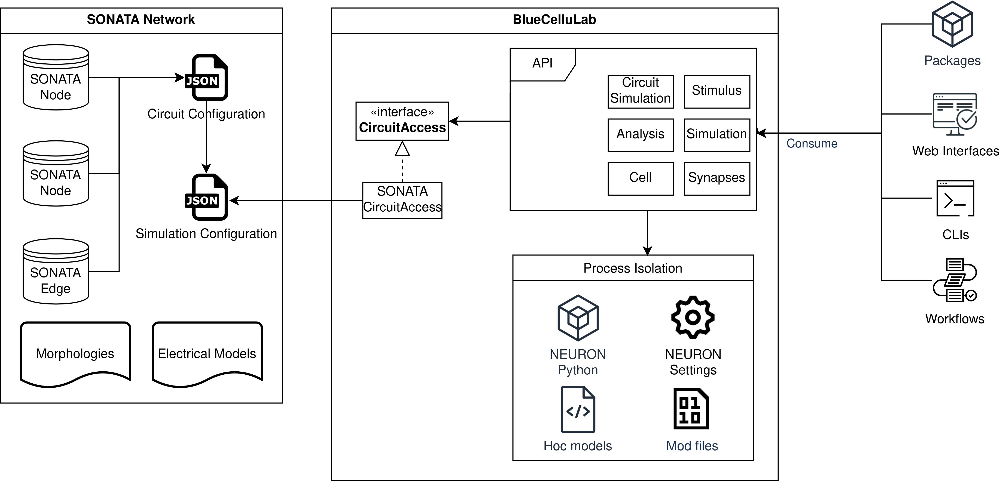
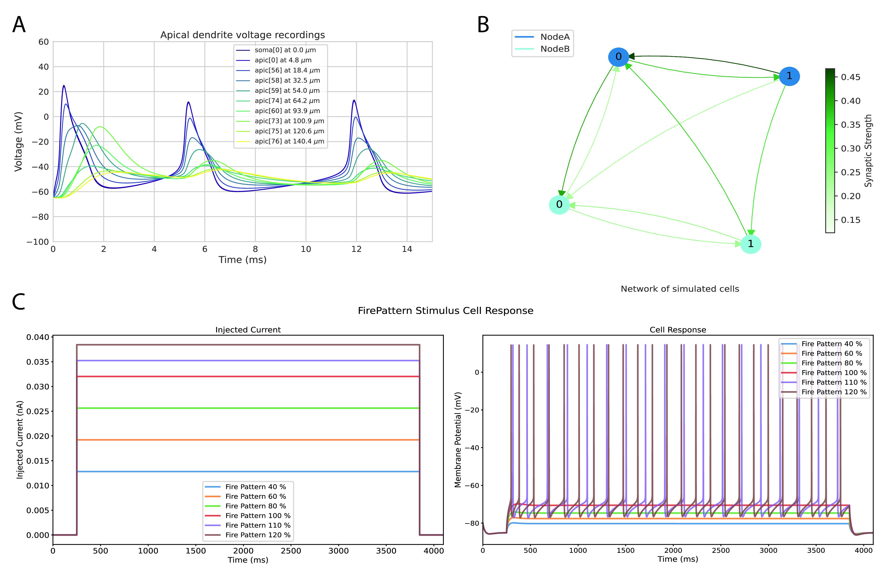

# Summary

The NEURON simulator, established in 1984 and continuously developed since, stands as the preeminent tool for neuron simulation within computational neuroscience. Its widespread adoption and compatibility with computational clusters and supercomputers underscore its pivotal role in large-scale neuronal research. However, its integration with the Python programming language has introduced complexities, particularly concerning memory management and object lifecycle. To conceal these challenges from the user and seamlessly interface with community standards for neural network representation data formats such as SONATA, we introduce BlueCelluLab. The high-level Python API simplifies the execution of neural simulations, ranging from single neurons to intricate networks, by managing complexities related to memory management and object lifecycle, thus providing a streamlined experience for users. Today, BlueCelluLab is powering various Python packages, command line interfaces, web applications, and data analysis workflows.

# Statement of Need

The NEURON simulator has been a cornerstone in computational neuroscience for decades and is now the most frequently used neuron simulator in the field [@Tikidji2017]. The NEURON simulator is renowned for its high efficiency in running large-scale simulations and maintains strong compatibility with computational clusters and modern supercomputer architectures, making it well-suited for utilisation across parallel computing environments [@Kumbhar2019; @Awile2022].

Initially, the NEURON simulator was programmed using the hoc (higher order calculator) interpreted programming language [@kernighan1984unix]. Years later, a Python interface was developed to facilitate communication with the NEURON simulator, making it accessible to Python users [@Hines2009]. The NEURON package, though resembling a typical Python package and importable like many others, exhibits significant operational differences. One major difference is that the scope and lifetime of NEURON objects do not align with those of typical Python objects. If not properly managed, these discrepancies can lead to memory safety vulnerabilities that compromise system security, consume excessive resources, and potentially corrupt scientific results. This places an undue burden on scientists to manage technical details beyond their experimental focus.

Moreover there is a need for an interface that can load and simulate neural networks from the SONATA data format [@Dai2020] jointly developed by the Allen Institute and the Blue Brain Project. BlueCelluLab's API supports loading and simulating SONATA networks with the NEURON simulator, offering a highly configurable environment. Users can load the entire network or selectively load subsets tailored to specific scientific inquiries. For example, if a study focuses on the behavior of a particular neuronal electrical type, users can select and simulate only those specific neurons from the SONATA network.

BlueCelluLab complements the Blue Brain Project's large-scale simulator neurodamus [@fernando_pereira_2024_10809263], which runs NEURON simulations in parallel using MPI. This integration allows for efficient replay simulations in BlueCelluLab, where researchers can adjust neuron properties and rerun parts of simulations generated by neurodamus. This method saves resources and enables the observation of how changes in a neuron or group of neurons influence their behavior within the entire network.

# System Overview



The system overview, as illustrated in Figure 1, shows that BlueCelluLab is built on top of the NEURON Python package, providing a high-level API tailored for the common use cases of single neuron or neural network simulations. The figure depicts the key components and interactions within BlueCelluLab, highlighting the modular design that facilitates integration and extension.

BlueCelluLab employs an IsolatedProcess mechanism to run simulations in separate processes when required. For example, prior to simulating neurons, users may need to conduct preliminary simulations to calculate specific properties of the neurons that will be utilised during the main simulation.

The network representation in BlueCelluLab is not confined to the SONATA format. With the use of dependency inversion principle [@martin2003agile], any network format that implements the CircuitAccess interface is seamlessly supported without requiring any integration effort at the API level. Currently, there are two distinct implementations available: one for SONATA and another for an internal format used by the Blue Brain Project.

External systems, such as other Python packages, web backends, CLIs, or software workflows, interact with the high-level API without needing to know its detailed implementation, thus embodying the principle of information hiding [@parnas1972criteria].

BlueCelluLab covers common error scenarios to prevent crashes and improve user experience, enhancing system robustness significantly. Additionally, it is designed to fail gracefully in cases of misusage, further safeguarding against disruptions and maintaining a smooth operational flow.

The code snippet below demonstrates the initialisation and execution of a neural simulation using BlueCelluLab.

```python
from bluecellulab.cell import create_ball_stick
from bluecellulab import Simulation

cell = create_ball_stick()
sim = Simulation()
sim.add_cell(cell)
stimulus = cell.add_step(start_time=5.0, stop_time=20.0, level=0.5)

sim.run(25)
time, voltage = cell.get_time(), cell.get_soma_voltage()
```

A neuron model is created using the create_ball_stick function, representing a basic type of neuron model. A simulation environment is initialised with Simulation(), and the created cell is added to this environment using sim.add_cell(cell). Next, a stimulus is attached to the neuron, activating it between 5.0 ms and 20.0 ms with a stimulation level of 0.5 nA (nanoamperes). The simulation is run for a total of 25 ms. Finally, time and soma voltage data are retrieved for further analysis and visualisation.

BlueCelluLab interfaces with various type systems, including those from Python, NEURON, network data formats, and dependencies such as numeric computing or data frame packages. To ensure type safety, it employs PEP-484 type annotations [@van2014pep] and a static type checker [@lehtosalo2017mypy] for early error detection during static analysis. For dynamic input lacking type information at static time, BlueCelluLab uses the Pydantic Data Validation package [@pydantic_v2.6.4] to identify errors at runtime, thereby enhancing system robustness.




Figure 2: Illustrative examples of applications using bluecellulab: (A) Voltage recordings from the soma and various apical dendrite sections of a simulated pyramidal neuron, showcasing distinct potential changes across different cellular regions. (B) A graphical representation of a neuronal network, where edge colours indicate connection strengths and node types correspond to different neural subnetworks, such as the hippocampus and thalamus. (C) Responses of a neuron to different step current injection. The left figure displays the injected current and the right figure demonstrate variations in voltage behavior and spiking frequency relative to the amplitude of the applied currents that are expressed as percentages of rheobase current of the simulated neuron.

We believe that while BlueCelluLab is focused on computational neuroscience, the ideas that shaped its design decisions will also prove beneficial in research software across various multidisciplinary fields.

# Acknowledgements
This study was supported by funding to the Blue Brain Project, a research center of the École polytechnique fédérale de Lausanne (EPFL), from the Swiss government’s ETH Board of the Swiss Federal Institutes of Technology.

# References
